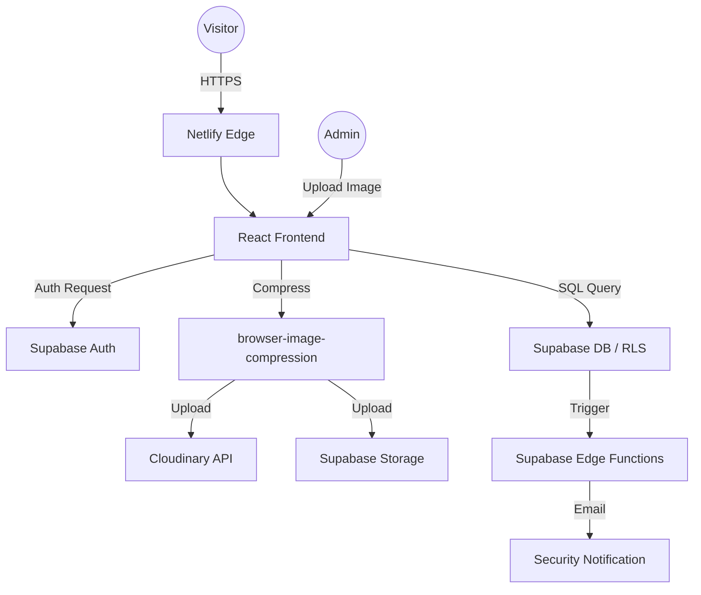

# 🏛 System Architecture - Leo Club of SUSL

This document outlines the high-level architecture, design decisions, and data flow of the Leo Club of Sabaragamuwa University of Sri Lanka (SUSL) website.

---

## 1. System Overview
The website is a **Serverless Headless CMS** application. It separates the presentation layer (React) from the data layer (Supabase & Cloudinary) to ensure high performance, security, and ease of management.

### 🧩 High-Level Components
1.  **Frontend (UI/UX)**: A Single Page Application (SPA) built with React and Vite.
2.  **Backend (BaaS)**: [Supabase](https://supabase.com/) provides the PostgreSQL database, Authentication, and Edge Functions.
3.  **Media Assets**: [Cloudinary](https://cloudinary.com/) handles image transformations and global delivery.
4.  **Hosting**: [Netlify](https://www.netlify.com/) provides the global Edge network and CI/CD pipelines.

---

## 2. Technical Stack
| Layer | Technology | Rationale |
|---|---|---|
| **Language** | TypeScript | Type safety prevents runtime errors in complex UI logic. |
| **Framework** | React 18 | Industry standard with a powerful ecosystem (Hooks, Context). |
| **Styles** | Tailwind CSS | Utility-first approach for rapid, consistent UI development. |
| **State Management** | React Context API | Simple and effective for sharing data (Auth, Theme, Site Data). |
| **Database** | PostgreSQL (Supabase) | Relational data is crucial for linking members, projects, and awards. |
| **Security** | Supabase Auth + RLS | Industry-standard JWT-based auth with row-level data protection. |
| **Hosting** | Netlify | Best-in-class CI/CD and automatic SSL/DNS management. |

---

## 3. Data Flow

---

## 4. Security Model
The application implements a **Zero Trust** architecture at the database level:
- **Row Level Security (RLS)**: Every table has specific policies. Public visitors can only *Read* (SELECT) data. Only authenticated admins can *Write* (INSERT/UPDATE/DELETE).
- **Security Logs**: Every login attempt (success or failure) is logged in the `security_logs` table.
- **Edge Functions**: A custom Supabase Edge Function (`security-alert`) monitors for brute-force patterns and triggers email notifications to administrators.
- **Authentication**: Using Supabase Auth (GoTrue) with JWTs ensuring that session hijacking is minimized.

---

## 5. Storage Strategy (Hybrid)
We use a dual-storage strategy to balance performance and management:
- **Supabase Storage**: Best for administrative and high-value club assets (e.g., leadership photos, official logos).
- **Cloudinary**: Best for bulk visual content (Gallery, Awards). Cloudinary automatically converts images to modern formats like `.webp` and `.avif` based on the user's browser, significantly reducing page load times.

---

## 6. Optimization Techniques
- **Code Splitting**: Routes are lazily loaded using `React.lazy()` and `Suspense`, ensuring the initial bundle stays small.
- **Client-Side Compression**: Images are compressed on the user's device before upload using `browser-image-compression` to stay within free-tier storage limits.
- **Responsive Design**: Mobile-first approach using Tailwind's breakpoint system.
- **SEO & Accessibility**: 
    - `react-helmet-async` for dynamic meta tags.
    - WCAG AA compliant color contrast and ARIA labeling.

---

## 7. Infrastructure Lifecycle
- **Version Control**: Git (GitHub) is the source of truth.
- **CI/CD**: Netlify monitors the `main` branch. A push to `main` triggers a production build.
- **DNS**: Managed via Netlify's globally distributed nameservers for low latency.

---
*Maintained by the ICT Committee, Leo Club of SUSL.*
